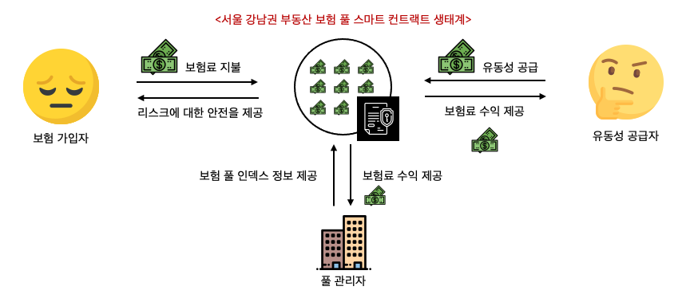

## ⭐️ Viewdefi 개요
한화 드림인 블록체인 해커톤 공모작 <br />
**지역별 인덱스를 이용한 자동화된 부동산 보험/투자 인슈어테크 서비스**
* [한화 드림인 블록체인 해커톤 소개](https://dreamin.career/academy/hackathon)

## Viewdefi 소개

뷰디파이는 부동산 지역별 인덱스를 이용해 보험 상품을 구현한 인슈어테크 서비스입니다. 서비스에 대한 설명은 풀, 유동성 공급자, 보험 가입자, 풀 관리자 순서로 설명하고 마지막으로는 이 서비스의 비즈니스 가능성을 서술하는 순서로 설명합니다.
* **풀(Pool):** 하나의 지역에는 하나의 풀이 있습니다. 그림을 보면 강남구 보험풀의 그림을 보여주고 있습니다. 이런식으로 서초구, 마포구 등 지역별로 하나의 풀이 존재하며 누구나 새로운 풀을 개설할 수 있습니다. 이 풀에는 해당 지역의 전체 주택 매매가격의 평균가격을 1,000,000으로 나눈 인덱스 값이 일자별로 저장되어 있습니다. 이 인덱스는 해당 지역 부동산 가격의 상승/하락 추세를 보여줍니다.
* **유동성 공급자(Liquidity Provider):** 하나의 풀에는 운용 가능한 자산이 존재해야 합니다. 이 풀에 자산을 공급하는 집단이 유동성 공급자입니다. 이 집단은 해당 지역의 부동산 가격이 상승한다고 생각하며 가입을 하며 전체 시장이 하락하지 않는 한 자산의 손실이 발생하지 않습니다. 후에 보험 가입자가 지불한 보험 가입료를 유동성 공급자가 공급한 자산 비율에 따라 나눠가집니다.
* **보험 가입자(Insurance User):** 보험 가입자는 주택을 소유하는 소유주이거나 부동산 시장이 하락한다고 생각하는 집단입니다. 보험 풀에 가입할 때 책정된 보험료와 하락할 인덱스의 마지노선인 위험 지수(Risk Index) 그리고 보험 마감일을 입력해야 하며, 실제 시장이 해당 위험 지수 밑으로 떨어졌을 때 이 집단은 보험 풀에 보험금을 청구할 수 있습니다. 만약 4억원 짜리 주택을 가지고 있는 집주인이라고 가정하고, 위험지수가 300(평균 매매가 3억)미만으로 하락할 경우 본인이 가지고 있는 자산가치가 하락한 주택을 판매하고 보험풀에 보험금을 청구하여 손실을 보전할 수 있습니다.
* **풀 관리자(Pool Admin):** 풀 관리자는 풀에 이용되는 인덱스 가격을 투명하게 관리하는 집단입니다.

비트코인 광풍이 불고, 블록체인의 가능성을 설파할 때부터 업계에는 오랜 염원이 있었습니다. 부동산 시장을 토큰화 하여 증권형 토큰을 만들자! 입니다. 하지만, 실제 실거주가 아닌 투기 목적으로 주택을 소유할 때의 법적 문제와, 세금 등의 리스크가 존재하였고 많은 기업이 부동산 시장의 토큰화를 하겠다며 나타났지만 아직까지 이렇다 할 성과를 만들지 못했습니다. 반면, 뷰-디파이는 인덱스 값을 이용하여 유동성 공급자와 보험 가입자간의 동기를 부여함으로서 부동산 시장을 간접적으로 투자할 수 있는 생태계를 구축했습니다. <br/><br/>

이것이 얼마나 비즈니스가 될지는 모르겠지만, 부동산 시장을 블록체인으로 거래했을 때 시장성이 있는지 테스트 할 수 있는 한 방법이 될 수 있다고는 생각합니다. 왜냐면, 뷰-디파이는 시작 초기부터 전세계 모든 지역의 풀을 개설해서 거래할 수 있기 때문에 건물 하나씩 증권화 하는 것보다 접근성이 좋고 잠재 유저 수가 많기 때문입니다.

## 🧪 공시지가 데이터 기준 아파트 인덱스
본 프로젝트에서는 지역별로 발생한 매매가격을 하나의 인덱스로 생성하고, 이 인덱스를 이용한 보험 서비스를 구축합니다. 그래서 우리는 특정 지역의 인덱스 정보가 유의미한 데이터를 가지는지 알고자 했습니다.

데이터는 [국토교통부 아파트매매 실거래 상세 자료 API](https://data.go.kr/tcs/dss/selectApiDataDetailView.do?publicDataPk=15057511)를 이용했습니다. 이 데이터는 부동산 정보 기업인 직방에서도 사용하고 있습니다. API 특성상 과거 정보로부터 인덱스를 생성하려면 여러번 호출해야 하기 때문에 python으로 코딩했고 시각화에 pyplot 패키지를 이용했으며 이 코드는 experiments 폴더에 구현되어 있습니다. 아래 그림은 8개의 지역구를 2017년 12월 부터 2020년 12월 까지 아파트 매매가격의 평균 인덱스 그래프입니다 (단위: 만원). 그래프를 보면 모든 지역의 평균 매매가격은 전체적으로 우상향 했지만 중간에 가격이 하락하는 구간도 존재합니다.

| 서울시 강남구 | 서울시 관악구 | 서울시 마포구 |
|:---:|:---:|:---:|
| |||
| 경기도 분당구 | 인천시 부평구 | 안양시 동안구 |
|:---:|:---:|:---:|
| |||
| 서울시 서초구 | 경기도 수정구 | - |
|:---:|:---:|:---:|
| || - |

## 📚 사용한 기술 스택
📒 프론트-엔드

**리액트 네이티브 (React Native)**<br />
앱 애플리케이션 개발에는 리액트 네이티브를 이용합니다. 여러분 리액트 네이티브는 사랑입니다. Javascript와 CSS만 가지고도 네이티브 수준의 어플리케이션을 만들 수 있다니.. 여기까지만 해도 놀라운데 한 가지 더 좋은 소식이 있습니다. 아마도 리액트 네이티브의 사용성은 미래에 WASM의 성장으로 더 높아질 것으로 보입니다. Javascript는 인터프리터 언어로 런타임에서 실행하기 때문에 기본적으로 컴파일 언어보다 느립니다. 그러면서 동적 타입 언어라서 나름대로 타입 시스템이 있는데 자바스크립트는 이걸 실시간으로 타입 추론을 해서 굉장히 느립니다. 고맙게도 이 문제를 해결하기 위해 실리콘 밸리의 IT 기업들이 뭉쳐서 중간에 어셈블리 언어를 만들었는데 이것이 바로 WebAssembly(WASM)입니다. [리액트 네이티브가 WASM으로 동작한다면 Javascript를 사용해서 발생했던 성능 문제를 상당 부분 해결할 수 있을 것으로 보입니다.](https://www.usenix.org/system/files/atc19-jangda.pdf) 그래서 리액트 네이티브는 단순히 해커톤 용도로 빠르게 개발하는 용도가 아니라 미래에는 주류 개발 플랫폼으로 자리 잡을 가능성이 크다고 보는 전문가가 있습니다.

**리액트 네이티브 라이브러리**<br/>
여기서는 리액트 네이티브를 해커톤에서 도입할 때 쓸만한 라이브러리를 공유하고자 합니다.<br/>
해커톤 목적의 라이브러리란 빠르게 배워서 도입할 수 있어야 하며, 필요한 준비과정이 복잡하지 않아야 합니다.

* styled-components: 기존 css문법을 보면 자바스크립트에서 지원하지 않는 형태가 있습니다. 그래서 리액트 네이티브에서는 css의 padding-top을 paddingTop과 같은 camel case 명명법을 적용했는데 이게 은근히 귀찮고 재사용성을 떨어뜨립니다. styled-components는 자바스크립트에서 css와 동일한 문법을 사용할 수 있도록 지원하는 라이브러리로 리액트 네이티브 개발에 큰 도움이 됩니다. 

* recoiljs: 리액트에서는 상태 관리 프레임워크로 주로 Redux를 사용하나, 간혹 Mobx를 이용합니다. 그러나 제 경험상 이 두 라이브러리는 학습곡선이 큰 편인데다 한 번 세팅하는데 필요한 코드가 길기 때문에 해커톤에서 사용하기에는 부담스럽습니다. 반면, recoiljs는 가장 리액트 스러운 문법을 지원하자는 취지로 페이스북에서 개발한 상태관리 라이브러리로 atom과 selector라는 개념만 이해하면 바로 적용할 수 있기 때문에 해커톤에 아주 안성맞춤인 라이브러리라고 할 수 있습니다. 아래는 하나의 글로벌 상태를 관리하는 예시입니다.

* [faker.js](https://github.com/marak/Faker.js/): 데모용 웹사이트 시연할 때 샘플 데이터 직접 만드는 거 많이 번거롭잖아요? 우리 faker.js를 이용해서 샘플 데이터 수천개도 금방 만들어 봅시다. faker.js에는 사람 이름, 전화번호, 주소 등의 기본정보와 금융, 쇼핑, 회사, 차량 모델, 이미지등의 고급정보들 까지 랜덤으로 만들어주는 함수가 있습니다. 한국어도 지원하기 때문에 해커톤 시연용 라이브러리로는 부족함이 없습니다.

```javascript
// states/index.js
import { atom } from 'recoil'

export const globalState = atom({
    key: 'globalState', // key는 글로벌하게 유니크한 값으로 설정합니다.
    default: {
        id: 1,
        username: 'dohyeonlee'
    }
})

// app.js
import { useRecoilState } from 'recoil'
import { globalState } from './states'

const App = () => {
    // 사용 방법이 react에서 제공하는 useState와 동일합니다.
    // 바로 이게 recoiljs에서 말하는 리액트스러움인가 봅니다.
    let [global, setGlobal] = useRecoilState(globalState);

    return (
        <View>
            <Text>{global.id}</Text>
            <Text>{global.username}</Text>
        </View>
    )
}
```

📒 백-엔드

**Python3: Flask web framework**<br />
Node.js와 같은 스타일로 조립형으로 손쉽게 이용 가능한 웹 서버를 이용했습니다. Python에서 사용할 수 있는 유명한 웹 프레임워크는 크게 Django와 Flask 두 가지 입니다. Django의 경우 초기에 어느 정도 학습 시간을 요구하기 때문에 빠른 개발을 요구하는 해커톤에서 사용하기는 힘들다고 생각했습니다. Django는 좀 더 팀단위 프로젝트이고 장기적으로 유지보수 해야할 필요가 있는 프로젝트에 더 어울리는 도구입니다. 자바의 스프링 프레임워크와 성격이 유사하고 Flask는 Node.js와 더 비슷해서 조금만 배워도 바로 사용할 수 있다는 특징이 있습니다. 데이터베이스 접근이나 기타 요구는 필요에 따라 라이브러리를 익혀서 사용하면 됩니다.

📒 블록체인

**이더리움 Solidity**<br />
블록체인의 재밌는 특징 중 하나는 인프라 비용을 개발사가 아닌 사용자가 지불한다는 것입니다.<br />
이더리움을 이용하면 개발사는 서버 비용을 줄일 수 있어서 프로젝트를 저비용으로 장기간 유지할 수 있습니다.<br />
Solidity는 이더리움에서 지원하는 프로그래밍 언어로 '스마트 컨트랙트'라는 블록체인에서 실행되는 프로그램을 작성하는데 사용합니다.

## 모바일 앱 캡처 화면
| HomeScreen | LocationDetailScreen | ProvideLiquidityScreen |
|:---:|:---:|:---:|
|:---:|:---:|:---:|
| |||
| ProvideConfirmScreen | ProvideCompletionScreen | MyPortfolioScreen |
|:---:|:---:|:---:|
| |||
| RegisterDetailScreen | RegisterInsuranceScreen | - |
|:---:|:---:|:---:|
| || - |
