## ⭐️ Viewdefi 개요
한화 드림인 블록체인 해커톤 공모작 <br />
**지역별 인덱스를 이용한 자동화된 부동산 보험/투자 인슈어테크 서비스**
* [한화 드림인 블록체인 해커톤 소개](https://dreamin.career/academy/hackathon)

## Viewdefi 소개
TO-DO

## 🧪 공시지가 데이터 기준 아파트 인덱스
본 프로젝트에서는 지역별로 발생한 매매가격을 하나의 인덱스로 생성하고, 이 인덱스를 이용한 보험 서비스를 구축합니다. 그래서 우리는 특정 지역의 인덱스 정보가 유의미한 데이터를 가지는지 알고자 했습니다.

데이터는 [국토교통부 아파트매매 실거래 상세 자료 API](https://data.go.kr/tcs/dss/selectApiDataDetailView.do?publicDataPk=15057511)를 이용했습니다. 이 데이터는 부동산 정보 기업인 직방에서도 사용하고 있습니다. API 특성상 과거 정보로부터 인덱스를 생성하려면 여러번 호출해야 하기 때문에 python으로 코딩했고 시각화에 pyplot 패키지를 이용했으며 이 코드는 experiments 폴더에 구현되어 있습니다. 아래 그림은 8개의 지역구를 2017년 12월 부터 2020년 12월 까지 아파트 매매가격의 평균 인덱스 그래프입니다 (단위: 만원). 그래프를 보면 모든 지역의 평균 매매가격은 전체적으로 우상향 했지만 중간에 가격이 하락하는 구간도 존재합니다.

| 서울시 강남구 | 서울시 관악구 | 서울시 마포구 |
|:---:|:---:|:---:|
|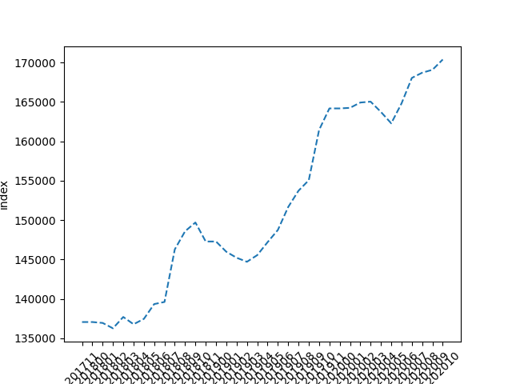 |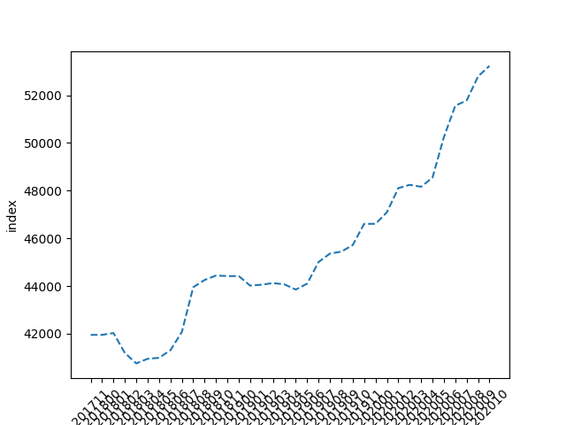|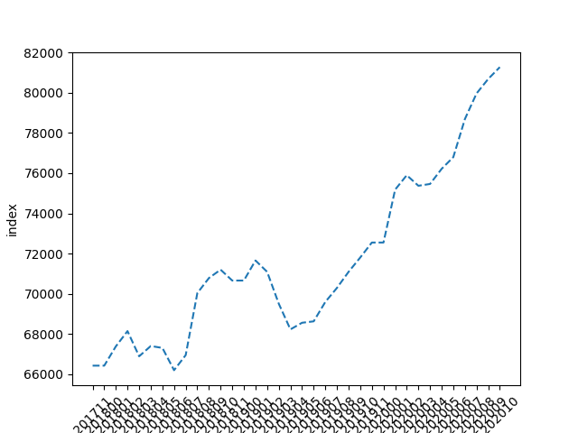|
| 경기도 분당구 | 인천시 부평구 | 안양시 동안구 |
|:---:|:---:|:---:|
|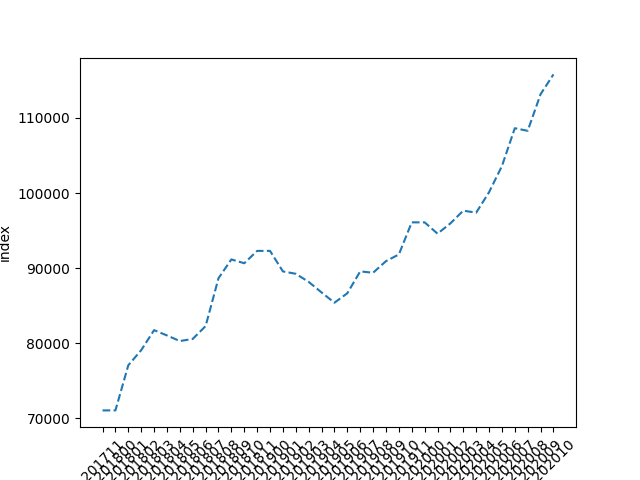 |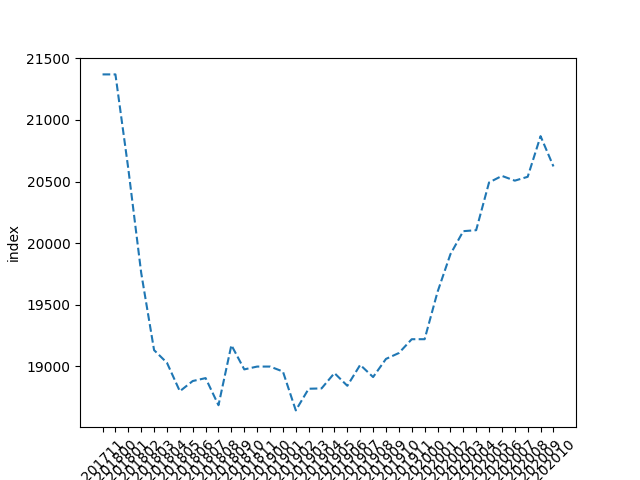|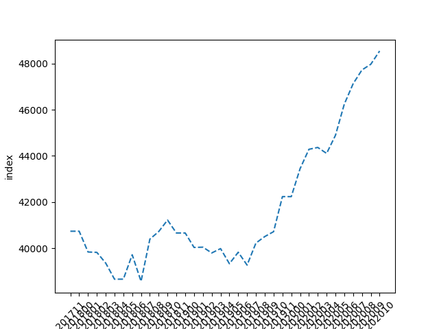|
| 서울시 서초구 | 경기도 수정구 | - |
|:---:|:---:|:---:|
|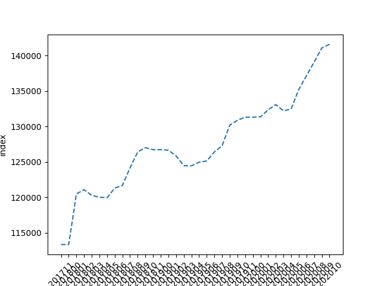 |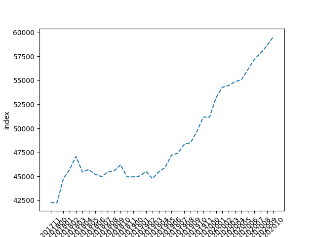| - |

## 📚 사용한 기술 스택
📒 프론트-엔드

**리액트 네이티브 (React Native)**<br />
앱 애플리케이션 개발에는 리액트 네이티브를 이용합니다. 여러분 리액트 네이티브는 사랑입니다. Javascript와 CSS만 가지고도 네이티브 수준의 어플리케이션을 만들 수 있다니.. 여기까지만 해도 놀라운데 한 가지 더 좋은 소식이 있습니다. 아마도 리액트 네이티브의 사용성은 미래에 WASM의 성장으로 더 높아질 것으로 생각합니다. Javascript는 인터프리터 언어로 런타임에서 실행하기 때문에 기본적으로 컴파일 언어보다 느립니다. 그러면서 동적 타입 언어라서 나름대로 타입 시스템이 있는데 자바스크립트는 이걸 실시간으로 타입 추론을 해서 굉장히 느립니다. 고맙게도 이 문제를 해결하기 위해 실리콘 밸리의 IT 기업들이 뭉쳐서 중간에 어셈블리 언어를 만들었는데 이것이 바로 WebAssembly(WASM)입니다. 리액트 네이티브가 WASM으로 동작한다면 Javascript를 사용해서 발생했던 성능 문제를 상당 부분 해결할 수 있을 것으로 보입니다. 그래서 리액트 네이티브는 단순히 해커톤 용도로 빠르게 개발하는 용도가 아니라 미래에는 주류 개발 플랫폼으로 자리 잡을 가능성이 크다고 보는 전문가가 있습니다.

**리액트 네이티브 라이브러리**<br/>
여기서는 리액트 네이티브를 해커톤에서 도입할 때 쓸만한 라이브러리를 공유하고자 합니다.<br/>
해커톤 목적의 라이브러리란 빠르게 배워서 도입할 수 있어야 하며, 필요한 준비과정이 복잡하지 않아야 합니다.

* styled-components: 기존 css문법을 보면 자바스크립트에서 지원하지 않는 형태가 있습니다. 그래서 리액트 네이티브에서는 css의 padding-top을 paddingTop과 같은 camel case 명명법을 적용했는데 이게 은근히 귀찮고 재사용성을 떨어뜨립니다. styled-components는 자바스크립트에서 css와 동일한 문법을 사용할 수 있도록 지원하는 라이브러리로 리액트 네이티브 개발에 큰 도움이 됩니다. 

* recoiljs: 리액트에서는 상태 관리 프레임워크로 주로 Redux를 사용하나, 간혹 Mobx를 이용합니다. 그러나 제 경험상 이 두 라이브러리는 학습곡선이 큰 편인데다 한 번 세팅하는데 필요한 코드가 길기 때문에 해커톤에서 사용하기에는 부담스럽습니다. 반면, recoiljs는 가장 리액트 스러운 문법을 지원하자는 취지로 페이스북에서 개발한 상태관리 라이브러리로 atom과 selector라는 개념만 이해하면 바로 적용할 수 있기 때문에 해커톤에 아주 안성맞춤인 라이브러리라고 할 수 있습니다. 아래는 하나의 글로벌 상태를 관리하는 예시입니다.

```javascript
// states/index.js
import { atom } from 'recoil'

export const globalState = atom({
    key: 'globalState', // key는 글로벌하게 유니크한 값으로 설정합니다.
    default: {
        id: 1,
        username: 'dohyeonlee'
    }
})

// app.js
import { useRecoilState } from 'recoil'
import { globalState } from './states'

const App = () => {
    // 사용 방법이 react에서 제공하는 useState와 동일합니다.
    // 바로 이게 recoiljs에서 말하는 리액트스러움인가 봅니다.
    let [global, setGlobal] = useRecoilState(globalState);

    return (
        <View>
            <Text>{global.id}</Text>
            <Text>{global.username}</Text>
        </View>
    )
}
```

📒 백-엔드

**Python3: Flask web framework**<br />
Node.js와 같은 스타일로 조립형으로 손쉽게 이용 가능한 웹 서버를 이용했습니다. Python에서 사용할 수 있는 유명한 웹 프레임워크는 크게 Django와 Flask 두 가지 입니다. Django의 경우 초기에 어느 정도 학습 시간을 요구하기 때문에 빠른 개발을 요구하는 해커톤에서 사용하기는 힘들다고 생각했습니다. Django는 좀 더 팀단위 프로젝트이고 장기적으로 유지보수 해야할 필요가 있는 프로젝트에 더 어울리는 도구입니다. 자바의 스프링 프레임워크와 성격이 유사하고 Flask는 Node.js와 더 비슷해서 조금만 배워도 바로 사용할 수 있다는 특징이 있습니다. 데이터베이스 접근이나 기타 요구는 필요에 따라 라이브러리를 익혀서 사용하면 됩니다.

📒 블록체인

**이더리움 Solidity**<br />
블록체인의 재밌는 특징 중 하나는 인프라 비용을 개발사가 아닌 사용자가 지불한다는 것입니다.<br />
이더리움을 이용하면 개발사는 서버 비용을 줄일 수 있어서 프로젝트를 저비용으로 장기간 유지할 수 있습니다.<br />
Solidity는 이더리움에서 지원하는 프로그래밍 언어로 '스마트 컨트랙트'라는 블록체인에서 실행되는 프로그램을 작성하는데 사용합니다.

## 모바일 앱 캡처 화면
| HomeScreen | LocationDetailScreen | ProvideLiquidityScreen |
|:---:|:---:|:---:|
|:---:|:---:|:---:|
|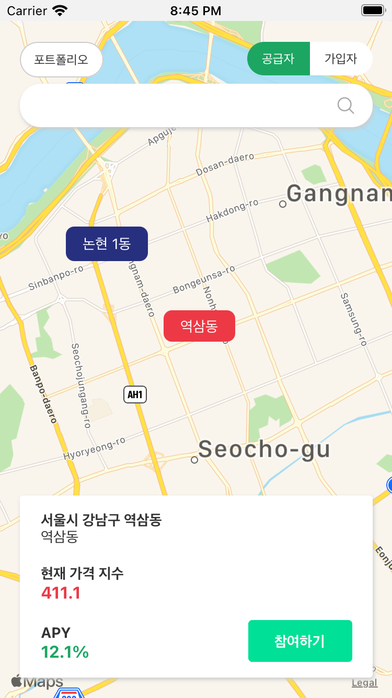 |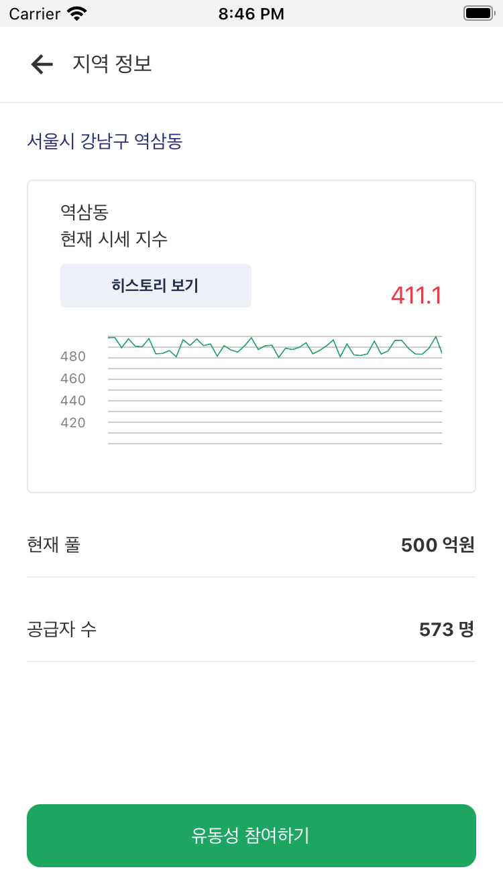|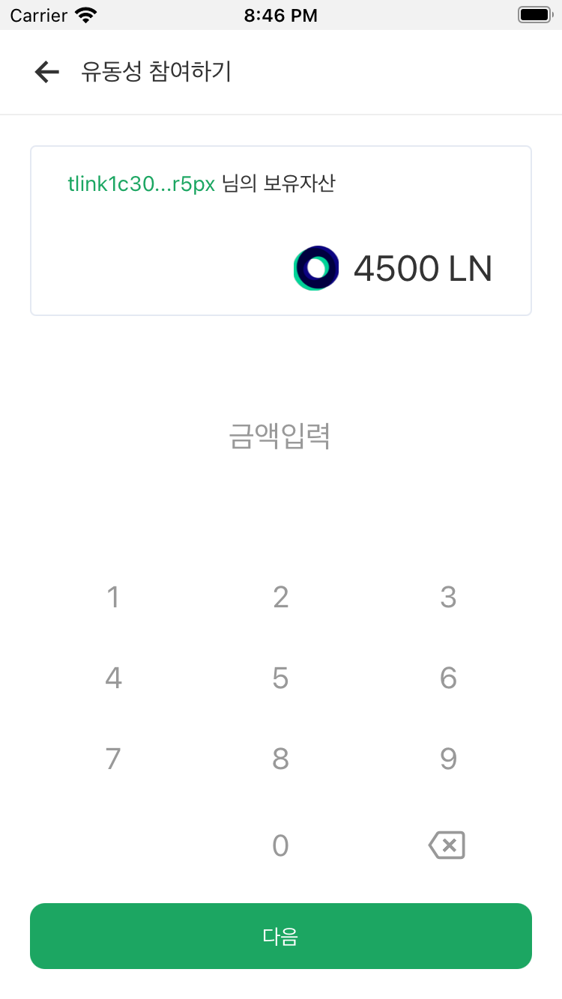|
| ProvideConfirmScreen | ProvideCompletionScreen | MyPortfolioScreen |
|:---:|:---:|:---:|
|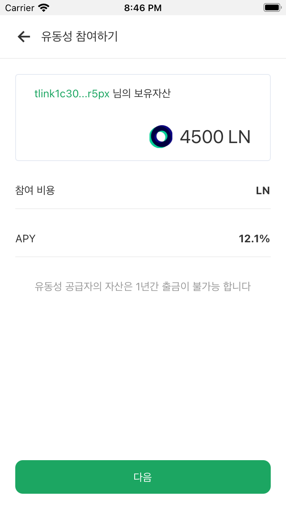 |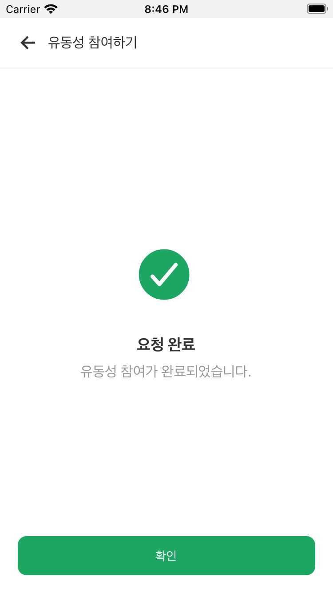|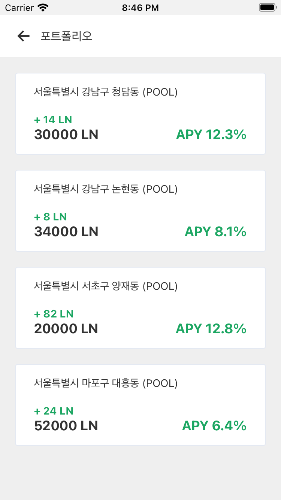|
| RegisterDetailScreen | RegisterInsuranceScreen | - |
|:---:|:---:|:---:|
|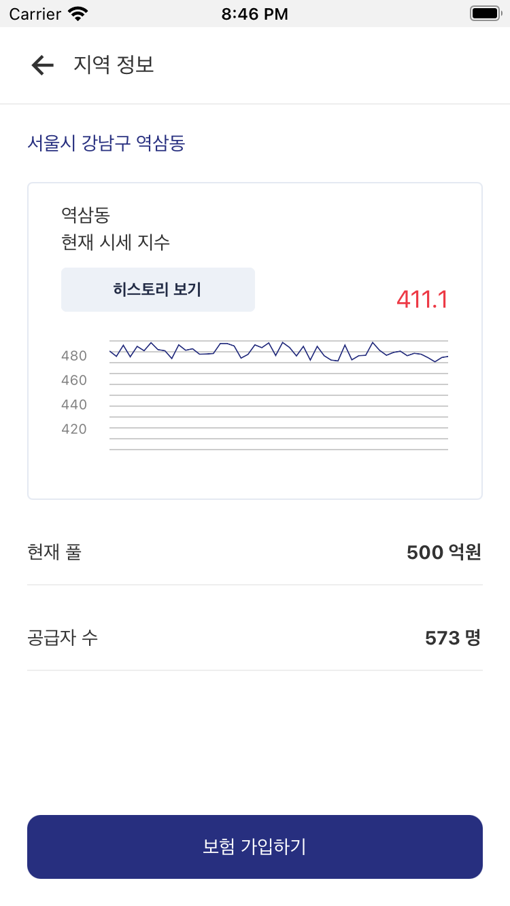 |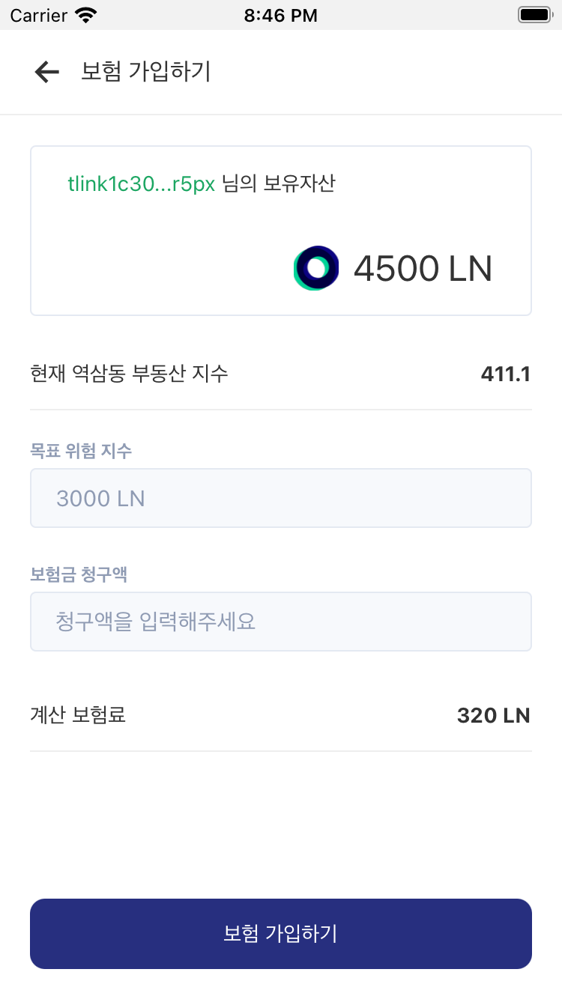| - |
